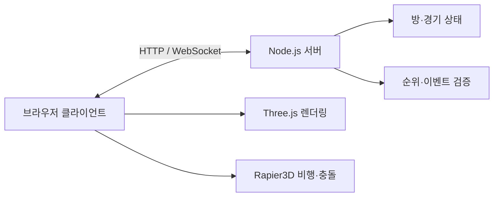

# Don't Land

> 종이비행기를 직접 선택하고, 친구들과 같은 하늘에서 비행 기록을 겨루는 브라우저 멀티플레이 게임입니다.

[](https://nodejs.org/)
[](./package.json)
[](./package.json)

[게임 플레이](https://dontland.devset.uk/) · [기술 문서](https://github.com/don-t-land/docs) · [제출 문서](https://github.com/don-t-land/report)

## 프로젝트 소개

Don't Land는 설치 없이 웹 브라우저에서 시작하는 3D 종이비행기 게임입니다. 닉네임을 입력한 뒤 공개방에 빠르게 참가하거나, 새 방을 만들고 여섯 자리 코드를 공유하여 친구를 초대할 수 있습니다. 기체마다 조종 반응과 비행 성격이 다르므로 경기 방식과 코스에 맞는 기체를 선택하는 과정부터 플레이가 시작됩니다.

게임은 서로 다른 목표를 가진 두 가지 모드를 제공합니다.

| 모드 | 인원 | 진행 방식 | 목표 |
| --- | ---: | --- | --- |
| 멀리 날기 `DIST` | 최대 4명 | 모든 참가자가 준비한 뒤 HOST가 라운드를 시작합니다. | 사막 협곡의 링, 장애물, 상승 기류를 활용하여 가장 먼 직선거리 기록에 도전합니다. |
| 오래 날기 `ARENA` | 최대 8명 | 기체 선택을 마치면 진행 중인 전장에 바로 합류합니다. | 지형과 다트를 활용하여 오래 생존하고 격추 기록을 쌓습니다. |

## 주요 기능

- Three.js로 구성한 3D 월드와 모드별 HUD를 제공합니다.
- Rapier3D의 고정 시간 간격 물리 계산으로 기체 힘, 충돌, 지형 상호작용을 처리합니다.
- 접기 프리셋에서 계산한 공력 특성과 충돌체를 실제 비행에 반영합니다.
- WebSocket으로 방 상태, 참가자, 기체 위치, 순위와 경기 이벤트를 동기화합니다.
- 공개방 빠른 참가, 비공개 코드 초대, 재접속 유예와 HOST 위임을 지원합니다.
- 키보드·마우스뿐 아니라 모바일 터치 조작과 반응형 HUD를 지원합니다.
- 그래픽, 오디오, 조작 설정을 브라우저에 저장하여 다음 접속에도 유지합니다.

## 빠른 시작

### 요구 환경

- Node.js 22 이상 25 미만을 사용합니다.
- npm을 패키지 관리 도구로 사용합니다.
- WebGL과 WebSocket을 지원하는 최신 브라우저가 필요합니다.

### 실행 방법

```bash
git clone https://github.com/don-t-land/dev.git
cd dev
npm ci
npm test
npm start
```

기본 서버는 `http://localhost:3000`에서 실행됩니다. 같은 네트워크의 다른 기기에서 접속하려면 방화벽과 포트 접근 정책을 함께 확인합니다.

### 환경 변수

| 변수 | 기본값 | 설명 |
| --- | --- | --- |
| `PORT` | `3000` | HTTP와 WebSocket 서버가 사용하는 포트를 지정합니다. |
| `HOST` | `0.0.0.0` | 서버가 수신할 네트워크 인터페이스를 지정합니다. |
| `RELEASE_ID` | `development` | 상태 확인 응답과 배포 검증에 사용할 릴리스 식별자를 지정합니다. |
| `FOLDING_MS` | `120000` | 기체 선택·접기 단계의 제한 시간을 밀리초로 지정합니다. |
| `RECONNECT_GRACE_MS` | `10000` | 연결이 끊긴 참가자의 복귀 유예 시간을 지정합니다. |
| `RESPAWN_COOLDOWN_MS` | `2000` | 오래 날기 재출격 대기 시간을 지정합니다. |

배포 관련 전체 설정은 [deploy/README.md](./deploy/README.md)에서 확인합니다.

## 기본 조작

| 입력 | 동작 |
| --- | --- |
| `W` / `S` | 기수를 내리거나 올립니다. |
| `A` / `D` | 기체를 좌우로 기울입니다. |
| `Shift` | 에너지를 사용하여 가속합니다. |
| 마우스 이동 | 비행 방향과 별개로 시점을 둘러봅니다. |
| `N` | 전술 지도를 표시하거나 숨깁니다. |
| `Space` | 오래 날기에서 다트를 발사합니다. |
| `Esc` | 설정 및 일시정지 메뉴를 엽니다. |

설정 화면에서 키 안내, 마우스 Y축 반전, 그래픽 품질과 오디오 크기를 조정할 수 있습니다.

## 동작 구조



클라이언트는 로컬 기체를 즉시 예측하여 조작 지연을 줄이고, 원격 기체 상태를 보간하여 표시합니다. 서버는 방의 단계와 참가 상태를 관리하고, 비정상적인 이동·점수·발사·스폰 요청을 제한합니다. 클라이언트 비행 상태는 초당 15회 전송하며, WebSocket 메시지는 연결당 속도와 16KiB 크기 제한을 적용합니다.

## 저장소 구성

```text
.
├── server.js                         # HTTP·WebSocket 게임 서버
├── public/
│   ├── index.html                    # 게임 UI와 클라이언트 진입점
│   ├── flight-physics-rapier.mjs     # Rapier 기반 비행 물리
│   ├── paper-fold-model.js           # 종이 접기 모델
│   ├── paper-aero-profile.js         # 접기 결과의 공력 특성 계산
│   ├── map-gen.js                    # 시드 기반 맵 생성
│   └── biomes/                       # 바이옴별 환경 구성
├── test/                              # 서버·클라이언트 회귀 테스트
├── ci/jenkins-job.xml                # Jenkins 작업 정의
└── deploy/                            # 배포·롤백 스크립트와 운영 문서
```

## 테스트와 상태 확인

```bash
npm test
curl http://localhost:3000/healthz
```

`npm test`는 Node.js 기본 테스트 러너로 방 수명주기, 실시간 동기화, 비행 물리, 접기 모델, UI 정책과 보안 제한을 검증합니다. `/healthz`는 서버 상태와 현재 `RELEASE_ID`를 JSON으로 반환합니다.

## 배포

`main` 브랜치에 반영된 변경은 Jenkins 작업에서 다음 순서로 배포합니다.

1. 저장소를 체크아웃하고 `npm ci`와 `npm test`를 실행합니다.
2. 변경할 수 없는 새 릴리스 디렉터리를 생성합니다.
3. 심볼릭 링크를 원자적으로 전환합니다.
4. `/healthz`와 WebSocket 연결을 확인합니다.
5. 검증에 실패하면 이전 릴리스로 되돌립니다.

배포 서버의 경로와 자격 증명은 저장소에 기록하지 않으며 Jenkins Credentials에서 관리합니다.

## 관련 저장소

| 저장소 | 용도 |
| --- | --- |
| [don-t-land/dev](https://github.com/don-t-land/dev) | 게임 클라이언트, 서버, 테스트와 배포 코드를 관리합니다. |
| [don-t-land/docs](https://github.com/don-t-land/docs) | 아키텍처, 프로토콜, 운영 기록과 협업 자료를 관리합니다. |
| [don-t-land/report](https://github.com/don-t-land/report) | 게임 소개서, AI 활용 기술 문서와 팀원 역할 기술서의 원본을 관리합니다. |

## 기여 및 보안

변경 사항은 목적별로 작게 커밋하고, 제출 전에 `npm test`를 실행합니다. 토큰, 배포 키, 개인 정보와 비공개 대화 원문은 커밋하지 않습니다. 네트워크 프로토콜이나 경기 규칙을 변경할 때는 테스트와 관련 문서도 함께 갱신합니다.

## 라이선스

패키지 메타데이터는 ISC 라이선스를 선언합니다. 제3자 라이브러리와 글꼴·이미지 등 개별 자산에는 각 항목의 라이선스가 별도로 적용될 수 있습니다.
